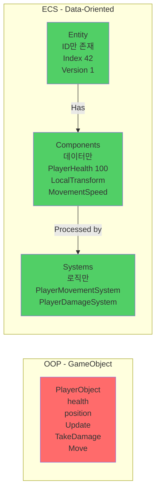
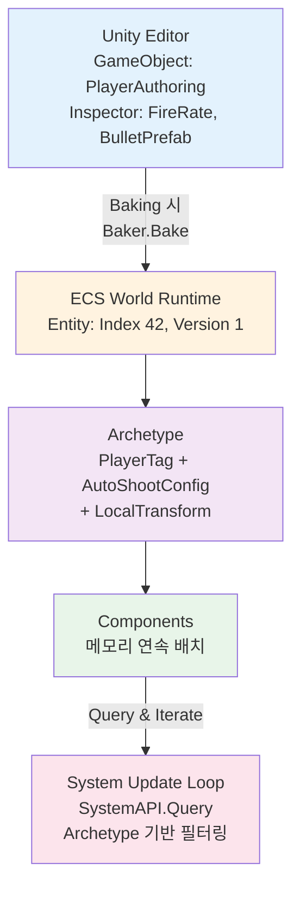
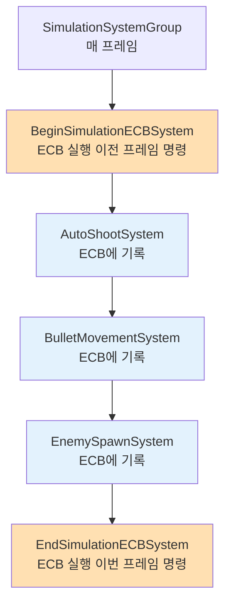
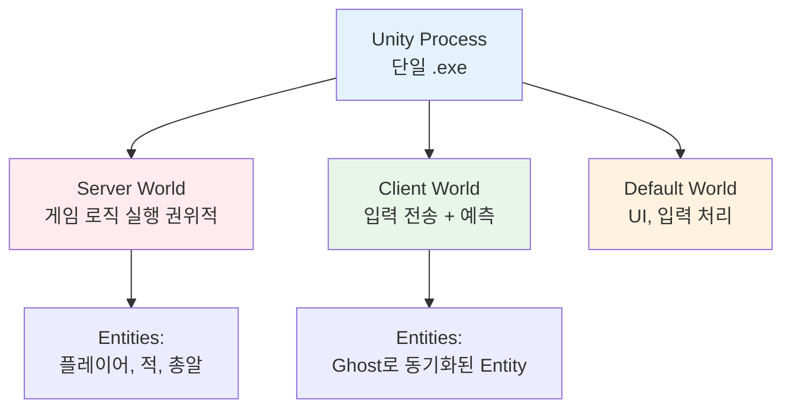
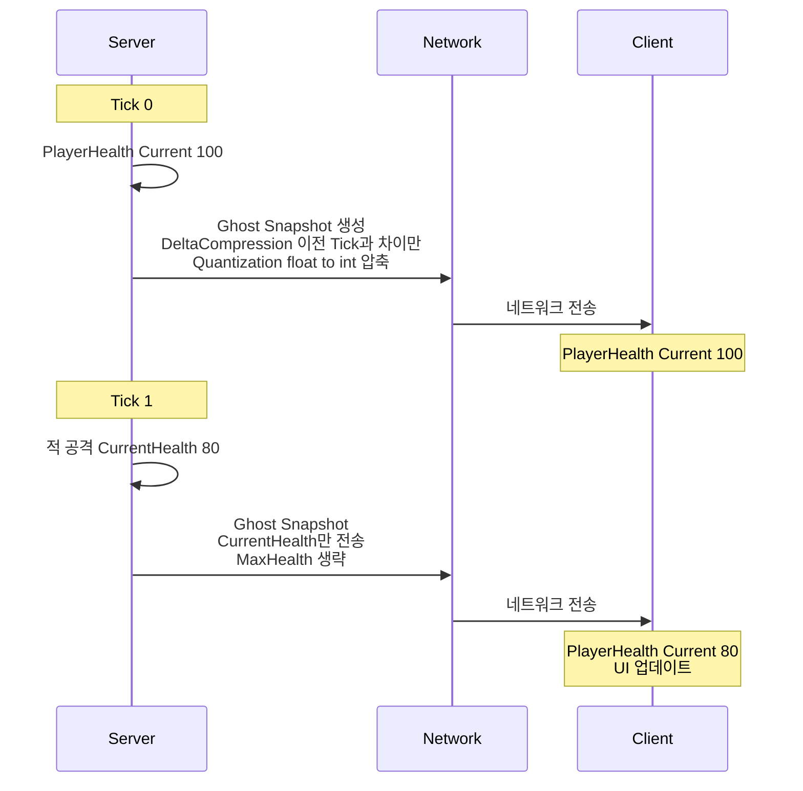
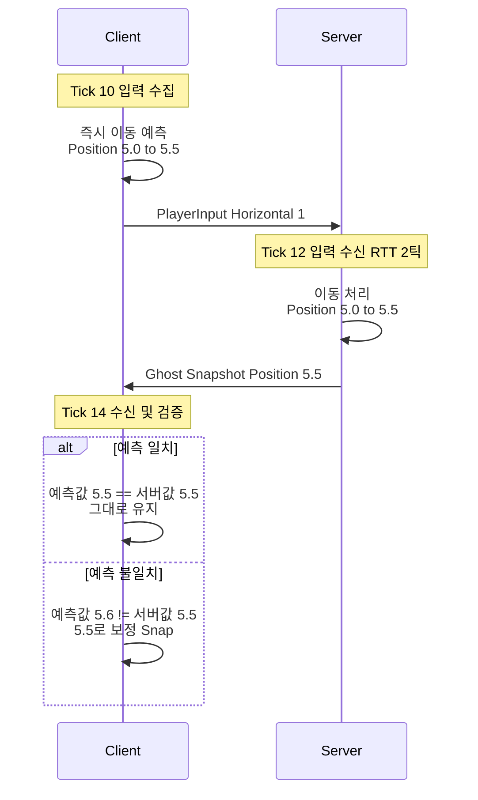
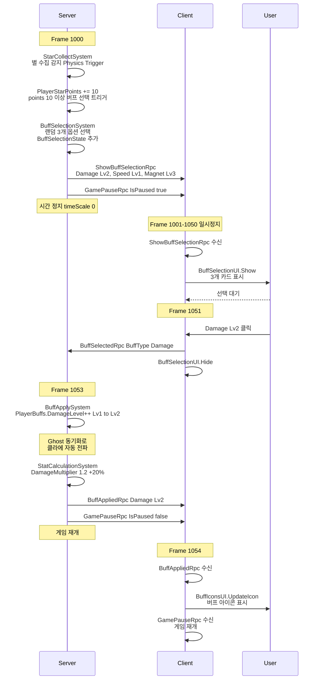
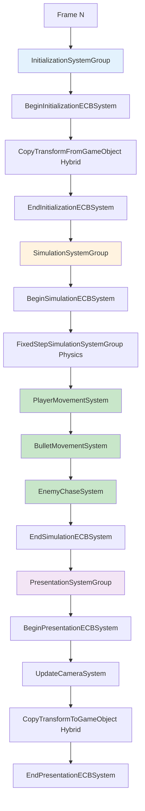

# ProjectC - Unity DOTS 멀티플레이어 우주 슈팅 게임

<div align="center">

**Unity Entities + Netcode for Entities 기반 고성능 서바이벌 슈터**

[](https://unity.com/)
[]()
[]()

[게임 소개](#-게임-소개) • [빠른 시작](#-빠른-시작) • [아키텍처](#-아키텍처-상세) • [개발 가이드](#-개발-가이드)

</div>

---

## 📹 게임 영상

### 🎬 소개 영상

https://github.com/user-attachments/assets/INTRODUCE_VIDEO_URL_HERE

<sub>💡 **업로드 필요:** GitHub Issues에 `movie/introduce.mp4`를 드래그 앤 드롭하여 생성된 URL로 위 링크를 교체하세요.</sub>

---

### 🎮 플레이 영상

https://github.com/user-attachments/assets/07e5c5ed-5831-4463-ad59-74e8c83206cd

---

## 🎮 게임 소개

**뱀파이어 서바이벌** 스타일의 3D 우주 슈팅 게임으로, **Unity DOTS (Data-Oriented Technology Stack)**와 **Netcode for Entities**를 활용한 고성능 멀티플레이어 게임입니다.

### 주요 특징

- 🚀 **고성능 최적화**: ECS + Burst Compiler로 수천 개의 Entity 동시 처리
- 🌐 **멀티플레이어**: Netcode for Entities 기반 서버-클라이언트 아키텍처
- 🎨 **사이버펑크 레트로**: Synthwave 스타일의 네온 비주얼
- ⚡ **자동 발사**: 가장 가까운 적을 자동 타겟팅하는 미사일 시스템
- 🎯 **버프 시스템**: 8종류의 버프, 각 5레벨까지 성장
- 💎 **아이템 수집**: 별 수집 → 포인트 임계값 → 버프 언락
- 🧲 **자석 효과**: 나선형 궤적으로 아이템을 끌어당기는 시각 효과

### 게임플레이

1. **조작**: WASD로 이동
2. **전투**: 자동 발사되는 미사일로 적 처치
3. **성장**: 별 수집 → 버프 선택 → 능력치 강화
4. **생존**: 끊임없이 스폰되는 적들을 피하며 최대한 오래 생존

---

## 🚀 빠른 시작

### 1. 프로젝트 열기

```bash
# 1. 저장소 클론
git clone https://github.com/lmo0317/projectc.git
cd projectc

# 2. Unity Hub에서 프로젝트 열기
- Unity Hub 실행
- 프로젝트 추가: d:\work\dev\game\projectc
- Unity 버전: 6000.1.7f1
```

### 2. 게임 실행

#### 싱글 플레이어 (빠른 테스트)
1. `Assets/Scenes/GameSceneSpace/GameSceneSpace.unity` 열기
2. Play 버튼 (Ctrl+P)
3. 자동으로 로컬 서버+클라이언트 시작

#### 멀티플레이어
1. `Assets/Scenes/LobbyScene.unity` 열기
2. "Start Server" 또는 "Start Client" 선택
3. 클라이언트는 서버 IP 입력 (기본: 127.0.0.1:7979)

---

## 🏗 아키텍처 상세

### DOTS (Data-Oriented Technology Stack) 구조

Unity DOTS는 **데이터 지향 설계**로 CPU 캐시 효율성을 극대화하여 고성능을 달성합니다.

#### 1. ECS 패턴의 핵심 개념

**전통적인 OOP vs ECS:**



| OOP 문제점 ❌ | ECS 장점 ✅ |
|:---|:---|
| • 데이터와 로직이 혼재 | • 메모리 연속 배치 (캐시 효율 ↑) |
| • CPU 캐시 미스 빈번 | • Burst 컴파일 가능 (SIMD 최적화) |
| • 다형성으로 인한 간접 참조 | • Job System 병렬화 용이 |

#### 2. Entity - Component - System 연결 구조



**Archetype 개념:**

| 구분 | 설명 |
|:---|:---|
| **정의** | 같은 Component 조합을 가진 Entity 그룹 |
| **예시 1** | `PlayerTag + Health + Transform` → Archetype A |
| **예시 2** | `EnemyTag + Health + Transform` → Archetype B |
| **장점** | Archetype별 메모리 연속 배치 → 캐시 효율 ↑ |

#### 3. 실제 구현: 플레이어 자동 발사 시스템

**단계 1: Component 정의 (순수 데이터)**

```csharp
// Components/AutoShootConfig.cs
using Unity.Entities;

/// <summary>
/// 자동 발사 설정 - 데이터만 포함, 로직 없음
/// </summary>
public struct AutoShootConfig : IComponentData
{
    public float Interval;        // 발사 간격 (초)
    public float Timer;           // 다음 발사까지 남은 시간
    public Entity BulletPrefab;   // 생성할 총알 Entity 프리팹
}
```

**왜 struct인가?**
- ✅ 값 타입 → 메모리 연속 배치
- ✅ GC 압박 없음 (Heap 할당 X)
- ✅ Burst 컴파일 가능

**단계 2: Authoring (GameObject → Entity 변환)**

```csharp
// Authoring/PlayerAuthoring.cs
using Unity.Entities;
using UnityEngine;

/// <summary>
/// Unity Editor에서 설정 가능한 MonoBehaviour
/// Baking 시점에 ECS Entity로 변환됨
/// </summary>
public class PlayerAuthoring : MonoBehaviour
{
    [Header("발사 설정")]
    public float FireRate = 0.25f;           // Inspector에서 조정 가능
    public GameObject BulletPrefab;

    [Header("이동 설정")]
    public float MoveSpeed = 5f;

    /// <summary>
    /// Baker: Editor 데이터 → ECS 데이터 변환
    /// Sub Scene 저장 시 또는 Play 시 자동 실행
    /// </summary>
    class Baker : Baker<PlayerAuthoring>
    {
        public override void Bake(PlayerAuthoring authoring)
        {
            // 1. Entity 생성 (이 GameObject를 대표하는 Entity)
            var entity = GetEntity(TransformUsageFlags.Renderable | TransformUsageFlags.Dynamic);

            // 2. Component 추가
            AddComponent(entity, new PlayerTag());  // 마커 태그

            AddComponent(entity, new MovementSpeed
            {
                Value = authoring.MoveSpeed
            });

            AddComponent(entity, new AutoShootConfig
            {
                Interval = authoring.FireRate,
                Timer = 0f,
                // GameObject 프리팹 → Entity 프리팹 변환
                BulletPrefab = GetEntity(authoring.BulletPrefab, TransformUsageFlags.Dynamic)
            });
        }
    }
}
```

**Baking 시점:**
- Sub Scene 저장 시 (Editor)
- Play 버튼 클릭 시 (Runtime)
- 빌드 시 (Build Time)

**단계 3: System (로직 처리)**

```csharp
// Systems/AutoShootSystem.cs
using Unity.Burst;
using Unity.Entities;
using Unity.Mathematics;
using Unity.Transforms;

/// <summary>
/// 플레이어 자동 발사 시스템
/// 서버에서만 실행 (권위적 로직)
/// </summary>
[WorldSystemFilter(WorldSystemFilterFlags.ServerSimulation)]  // 서버 전용
[UpdateInGroup(typeof(SimulationSystemGroup))]                // 시뮬레이션 단계
[BurstCompile]                                                 // 네이티브 컴파일
public partial struct AutoShootSystem : ISystem
{
    [BurstCompile]
    public void OnCreate(ref SystemState state)
    {
        // PlayerTag가 있어야 시스템 실행
        state.RequireForUpdate<PlayerTag>();
    }

    [BurstCompile]
    public void OnUpdate(ref SystemState state)
    {
        float deltaTime = SystemAPI.Time.DeltaTime;

        // EntityCommandBuffer: 구조적 변경(생성/삭제)을 안전하게 기록
        // SimulationSystemGroup 끝에 일괄 실행
        var ecb = SystemAPI.GetSingleton<BeginSimulationEntityCommandBufferSystem.Singleton>()
                          .CreateCommandBuffer(state.WorldUnmanaged);

        // Query: PlayerTag를 가진 모든 Entity의 AutoShootConfig + LocalTransform 순회
        foreach (var (shootConfig, transform, entity) in
                 SystemAPI.Query<RefRW<AutoShootConfig>, RefRO<LocalTransform>>()
                         .WithAll<PlayerTag>()
                         .WithEntityAccess())
        {
            // 타이머 감소 (RefRW = Read-Write 참조)
            shootConfig.ValueRW.Timer -= deltaTime;

            if (shootConfig.ValueRW.Timer <= 0f)
            {
                // 타이머 리셋
                shootConfig.ValueRW.Timer = shootConfig.ValueRO.Interval;

                // 총알 Entity 생성 (ECB에 기록)
                var bullet = ecb.Instantiate(shootConfig.ValueRO.BulletPrefab);

                // 플레이어 위치에서 발사
                ecb.SetComponent(bullet, LocalTransform.FromPosition(
                    transform.ValueRO.Position
                ));

                // 방향 설정 (여기서는 위쪽)
                ecb.SetComponent(bullet, new BulletDirection
                {
                    Value = new float3(0, 0, 1)
                });
            }
        }
    }
}
```

**핵심 개념 정리:**

| 개념 | 설명 | 예시 |
|------|------|------|
| **Query** | Component 조합으로 Entity 필터링 | `Query<RefRW<Health>, RefRO<Transform>>()` |
| **RefRW** | Read-Write 참조 (수정 가능) | `health.ValueRW.Current -= 10` |
| **RefRO** | Read-Only 참조 (읽기 전용) | `float3 pos = transform.ValueRO.Position` |
| **WithAll** | 특정 Component 보유 필터 | `.WithAll<PlayerTag>()` |
| **WithNone** | 특정 Component 미보유 필터 | `.WithNone<Dead>()` |
| **EntityCommandBuffer** | 구조적 변경 지연 실행 | `ecb.Instantiate()`, `ecb.DestroyEntity()` |

#### 4. EntityCommandBuffer 상세

**왜 필요한가?**

```csharp
// ❌ 잘못된 예: OnUpdate 중 직접 변경
public void OnUpdate(ref SystemState state)
{
    foreach (var entity in SystemAPI.Query<...>())
    {
        state.EntityManager.DestroyEntity(entity);  // ⚠️ 반복 중 구조 변경!
        // → Archetype 변경으로 순회 중인 배열이 무효화됨
        // → 크래시 또는 예측 불가능한 동작
    }
}

// ✅ 올바른 예: ECB로 지연 실행
public void OnUpdate(ref SystemState state)
{
    var ecb = /* EntityCommandBuffer */;

    foreach (var entity in SystemAPI.Query<...>())
    {
        ecb.DestroyEntity(entity);  // ✅ 기록만 함 (즉시 실행 X)
    }
    // SystemGroup 끝에 ECB 일괄 실행 → 안전
}
```

**ECB 실행 타이밍:**



---

### Netcode for Entities 구조

멀티플레이어에서는 **서버가 게임 로직 실행**, **클라이언트는 입력만 전송**합니다.

#### 1. 서버-클라이언트 World 분리

Unity Netcode는 **하나의 프로세스에 여러 World**를 생성합니다:



**각 World의 역할:**

<table>
<tr>
<th>🖥️ 서버 World (권위적)</th>
<th>💻 클라이언트 World (예측)</th>
</tr>
<tr>
<td>

**필터:** `[WorldSystemFilter(WorldSystemFilterFlags.ServerSimulation)]`

**시스템:**

✅ **AutoShootSystem** - 총알 생성 (서버만)
- 클라이언트는 Ghost로 동기화된 총알만 보임

✅ **EnemySpawnSystem** - 적 생성 (서버만)
- NetworkId를 가진 Entity만 생성

✅ **BulletHitSystem** - 충돌 판정 (서버만)
- 피격 판정은 서버가 결정 (클라 예측 X)
- HitEffectRpc로 클라에 이펙트만 요청

✅ **BuffApplySystem** - 버프 적용 (서버만)
- PlayerBuffs 컴포넌트 수정
- Ghost 동기화로 클라에 자동 전파

**네트워크 송신:**

📤 **Ghost 동기화**
- PlayerHealth, EnemyHealth, LocalTransform 등
- 매 Tick(50ms)마다 변경된 값만 전송

📤 **RPC 전송** (일회성 이벤트)
- HitEffectRpc: 피격 위치 + 데미지
- ShowBuffSelectionRpc: 버프 선택 UI 트리거

</td>
<td>

**필터:** `[WorldSystemFilter(WorldSystemFilterFlags.ClientSimulation)]`

**시스템:**

✅ **GatherPlayerInputSystem** - 키보드 입력 수집
- PlayerInput 컴포넌트에 저장
- 서버로 자동 전송 (IInputComponentData)

✅ **ProcessPlayerInputSystem** - 입력 → 이동 (양쪽 실행)
- 클라: 즉시 이동 (예측)
- 서버: Ghost로 최종 위치 전송
- 차이 발생 시 클라가 서버 위치로 보정

✅ **ClientStarVisualSystem** - 별 시각화 (클라 전용)
- StarSpawnRpc 수신 → GameObject 풀에서 표시
- 서버는 Entity만 관리, 클라는 비주얼 추가

✅ **HitEffectClientSystem** - 피격 이펙트 재생
- HitEffectRpc 수신 → 파티클 재생
- 서버는 로직만, 클라는 시각/청각 효과

**네트워크 수신:**

📥 **Ghost 수신** - 서버 상태 동기화
- Prediction: 입력 기반 즉시 예측
- Reconciliation: 서버 값과 차이 발생 시 보정

📥 **RPC 수신** - 이벤트 처리
- ⚠️ 수신 후 `ecb.DestroyEntity(rpcEntity)` 필수!

</td>
</tr>
</table>

**네트워크 통신 흐름:**

```
Server → Client:  Ghost Snapshot (20Hz), RPC (이벤트 발생 시)
Client → Server:  PlayerInput (20Hz), BuffSelectedRpc (버프 선택 시)
```

#### 2. Ghost 동기화 메커니즘

**Ghost란?** 서버 Entity를 클라이언트로 자동 동기화하는 시스템

```csharp
// Components/PlayerHealth.cs
using Unity.Entities;
using Unity.NetCode;

/// <summary>
/// [GhostComponent]: 이 컴포넌트는 서버→클라 동기화됨
/// [GhostField]: 이 필드는 네트워크로 전송됨
/// </summary>
[GhostComponent(PrefabType = GhostPrefabType.AllPredicted)]
public struct PlayerHealth : IComponentData
{
    [GhostField] public float CurrentHealth;  // 매 틱 동기화
    [GhostField] public float MaxHealth;      // 초기화 시 1회만
}
```

**동기화 플로우:**



**Prediction & Reconciliation:**



#### 3. RPC (Remote Procedure Call) 상세

**RPC vs Ghost 비교:**

| 특징 | Ghost | RPC |
|------|-------|-----|
| **전송 빈도** | 매 틱(20Hz, 50ms마다) | 이벤트 발생 시 1회 |
| **용도** | 지속적 상태 (체력, 위치) | 일회성 이벤트 (킬, UI) |
| **대역폭** | 높음 (DeltaCompression으로 최적화) | 낮음 |
| **신뢰성** | UDP + 재전송 | UDP (필요 시 재전송) |
| **예시** | `PlayerHealth`, `LocalTransform` | `HitEffectRpc`, `BuffSelectedRpc` |

**RPC 구현 예시:**

```csharp
// Components/Network/HitEffectRpc.cs
using Unity.Entities;
using Unity.NetCode;
using Unity.Mathematics;

/// <summary>
/// 피격 이펙트 RPC (Server → Client)
/// </summary>
public struct HitEffectRpc : IRpcCommand
{
    public float3 Position;   // 피격 위치
    public float Damage;      // 데미지 양
    public bool IsCritical;   // 치명타 여부
}
```

**RPC 전송 (서버):**

```csharp
// Systems/BulletHitSystem.cs (서버 전용)
[WorldSystemFilter(WorldSystemFilterFlags.ServerSimulation)]
public partial struct BulletHitSystem : ISystem
{
    public void OnUpdate(ref SystemState state)
    {
        var ecb = /* EntityCommandBuffer */;

        // 총알-적 충돌 처리
        foreach (var (damage, transform, bullet) in /* 충돌 검출 */)
        {
            // 1. 적 체력 감소 (서버 로직)
            enemy.Health -= damage;

            // 2. RPC Entity 생성
            var rpcEntity = ecb.CreateEntity();
            ecb.AddComponent(rpcEntity, new HitEffectRpc
            {
                Position = enemyPos,
                Damage = finalDamage,
                IsCritical = isCritical
            });

            // 3. 전송 대상 지정 (특정 클라 또는 전체)
            ecb.AddComponent(rpcEntity, new SendRpcCommandRequest
            {
                TargetConnection = Entity.Null  // Null = 모든 클라이언트
            });
        }
    }
}
```

**RPC 수신 (클라이언트):**

```csharp
// Systems/Network/HitEffectClientSystem.cs (클라 전용)
[WorldSystemFilter(WorldSystemFilterFlags.ClientSimulation)]
public partial class HitEffectClientSystem : SystemBase
{
    protected override void OnUpdate()
    {
        var ecb = EntityManager.CreateEntityCommandBuffer();

        // RPC Entity 순회 (ReceiveRpcCommandRequest 자동 부여됨)
        Entities
            .WithAll<ReceiveRpcCommandRequest>()
            .ForEach((Entity entity, in HitEffectRpc rpc) =>
            {
                // 1. 이펙트 재생 (MonoBehaviour 풀 사용)
                HitEffectPool.Instance?.SpawnHitEffect(
                    rpc.Position,
                    rpc.Damage,
                    rpc.IsCritical
                );

                // 2. RPC Entity 삭제 (필수!)
                ecb.DestroyEntity(entity);
            }).Run();

        ecb.Playback(EntityManager);
        ecb.Dispose();
    }
}
```

**⚠️ RPC 주의사항:**
1. **RPC Entity는 수신 후 반드시 삭제** (`ecb.DestroyEntity`)
2. **NetworkId 체크 필수** (서버 연결 전 RPC 수신 방지)
   ```csharp
   state.RequireForUpdate<NetworkId>();
   ```

#### 4. 실제 게임 플로우: 버프 선택 시퀀스



---

## 📁 프로젝트 구조

```
Assets/Scripts/
├── Authoring/                          # GameObject → Entity 변환 (Baker)
│   ├── PlayerAuthoring.cs              # 플레이어 Entity 생성
│   ├── EnemyAuthoring.cs               # 적 Entity 생성
│   └── BulletAuthoring.cs              # 총알 Entity 생성
│
├── Components/                         # 데이터만 포함 (IComponentData)
│   ├── PlayerTag.cs                    # 플레이어 식별 마커
│   ├── PlayerHealth.cs                 # [GhostField] 체력 동기화
│   ├── AutoShootConfig.cs              # 발사 설정
│   ├── Buffs/
│   │   ├── PlayerBuffs.cs              # [GhostField] 버프 레벨
│   │   └── StatModifiers.cs            # [GhostField] 계산된 스탯
│   └── Network/                        # RPC 정의
│       ├── HitEffectRpc.cs             # 피격 이펙트 RPC
│       └── BuffSelectedRpc.cs          # 버프 선택 RPC
│
├── Systems/                            # 로직 처리 (ISystem / SystemBase)
│   ├── AutoShootSystem.cs              # [Server] 자동 발사
│   ├── EnemySpawnSystem.cs             # [Server] 적 생성
│   ├── EnemyChaseSystem.cs             # [Server] 적 AI
│   ├── BulletHitSystem.cs              # [Server] 충돌 판정
│   ├── Buffs/
│   │   ├── BuffSelectionSystem.cs      # [Server] 버프 트리거
│   │   ├── BuffApplySystem.cs          # [Server] 버프 적용
│   │   └── StatCalculationSystem.cs    # [Server] 스탯 계산
│   └── Network/
│       ├── GatherPlayerInputSystem.cs  # [Client] 입력 수집
│       ├── ProcessPlayerInputSystem.cs # [Both] 입력 → 이동
│       └── HitEffectClientSystem.cs    # [Client] 이펙트 재생
│
├── Network/
│   └── SimpleNetworkBootstrap.cs       # 네트워크 초기화
│
└── UI/                                 # MonoBehaviour UI
    ├── BuffSelectionUI.cs              # 버프 선택 화면
    └── PlayerStatsUI.cs                # 체력, 포인트 표시
```

---

## 👨‍💻 개발 가이드

### 필수 개발 규칙

#### 1. TransformUsageFlags 올바른 사용 ⚠️

Baker에서 Entity 생성 시 Transform 동작 지정:

```csharp
// ❌ 잘못: 움직이지만 렌더링 안 됨!
var entity = GetEntity(TransformUsageFlags.Dynamic);

// ✅ 올바름: 움직이면서 보임
var entity = GetEntity(TransformUsageFlags.Renderable | TransformUsageFlags.Dynamic);
```

**플래그 종류:**
- `None`: 정적 오브젝트 (움직임 X, Transform 읽기 전용)
- `Dynamic`: 런타임에 Transform 변경 가능
- `Renderable`: 화면에 렌더링
- `WorldSpace`: World 좌표계 사용 (Parent 무시)

#### 2. RefRW 컴포넌트 직접 수정 ⚠️

구조체는 값 타입이므로 복사 방지:

```csharp
// ❌ 잘못: 복사본만 수정됨 (원본 변경 안 됨!)
var config = shootConfig.ValueRW;
config.Timer += deltaTime;

// ✅ 올바름: 체인 방식으로 직접 접근
shootConfig.ValueRW.Timer += deltaTime;
if (shootConfig.ValueRW.Timer >= shootConfig.ValueRW.Interval)
{
    shootConfig.ValueRW.Timer = 0f;
}
```

#### 3. SystemGroup 실행 순서

Unity ECS는 매 프레임마다 정해진 순서로 SystemGroup 실행:



**System 순서 지정:**

```csharp
[UpdateInGroup(typeof(SimulationSystemGroup))]
[UpdateAfter(typeof(PlayerMovementSystem))]  // PlayerMovementSystem 이후 실행
[UpdateBefore(typeof(BulletHitSystem))]      // BulletHitSystem 이전 실행
public partial struct BulletMovementSystem : ISystem { }
```

#### 4. 언어 설정 🇰🇷

- ✅ 코드 설명, 커밋 메시지 → **한국어**
- 📝 변수명, 함수명 → 영어

#### 5. API 사용 시 검증 필수

```csharp
// ❌ 금지: 추측해서 사용
NetDebug.SuppressTickBatchingWarning();  // 존재하지 않음

// ✅ 필수: 공식 문서 확인 후 사용
Application.runInBackground = true;
```

> 📚 **상세 규칙**: [CLAUDE.md](CLAUDE.md)

---

## 🎯 버프 시스템

8종류 버프, 각 5레벨:

| 버프 | 효과 | Lv5 |
|-----|------|-----|
| **Damage** | 데미지 증가 | +75% |
| **Speed** | 이동 속도 | +50% |
| **FireRate** | 공격 속도 | -80% 쿨다운 |
| **MissileCount** | 미사일 개수 | +6개 |
| **Magnet** | 자석 범위 | 15 유닛 |
| **HealthRegen** | 체력 재생 | 8 HP/s |
| **MaxHealth** | 최대 체력 | +150 HP |
| **Critical** | 치명타 | 30% 확률, 3.0배 |

**버프 선택 트리거**: 10 → 15 → 20 → 30 → 40 → +15씩

---

## ❓ 트러블슈팅

### 자주 발생하는 문제

#### 1. Ghost 동기화 안 됨
- [ ] `GoInGameSystem` 존재 확인
- [ ] `NetworkStreamInGame` 태그 확인
- [ ] GhostCollection의 Num Loaded Prefabs > 0

#### 2. Entity가 렌더링 안 됨
```csharp
// Baker에서 플래그 확인
var entity = GetEntity(TransformUsageFlags.Renderable | TransformUsageFlags.Dynamic);
```

#### 3. 컴포넌트 수정이 적용 안 됨
```csharp
// 직접 수정 (로컬 변수 복사 금지)
shootConfig.ValueRW.Timer += deltaTime;
```

#### 4. RPC 전송/수신 안 됨
- [ ] `RequireForUpdate<NetworkId>()` 추가
- [ ] `SendRpcCommandRequest` 컴포넌트 추가
- [ ] 수신 후 `ecb.DestroyEntity(entity)` 필수

---

## 📚 상세 문서

| 문서 | 설명 |
|------|------|
| [knowledge_ecs.md](Document/knowledge/knowledge_ecs.md) | Unity ECS 상세 학습 노트 |
| [knowledge_netcode.md](Document/knowledge/knowledge_netcode.md) | Netcode for Entities 학습 노트 |
| [spec.md](Document/spec.md) | 프로젝트 요구사항 명세 |
| [CLAUDE.md](CLAUDE.md) | Claude Code 개발 가이드라인 |

---

## 🔗 참고 자료

- [Unity Entities 공식 문서](https://docs.unity3d.com/Packages/com.unity.entities@latest)
- [Netcode for Entities 공식 문서](https://docs.unity3d.com/Packages/com.unity.netcode@latest)
- [NetcodeSamples 저장소](https://github.com/Unity-Technologies/EntityComponentSystemSamples)

---

## 📝 라이선스

개인 학습 및 포트폴리오 용도로 개발되었습니다.

**사용된 에셋**: Polygon SciFi Space, Polygon Arsenal, Cartoon FX Remaster

---

<div align="center">

**Made with ❤️ using Unity DOTS**

[⬆ 맨 위로](#projectc---unity-dots-멀티플레이어-우주-슈팅-게임)

</div>
